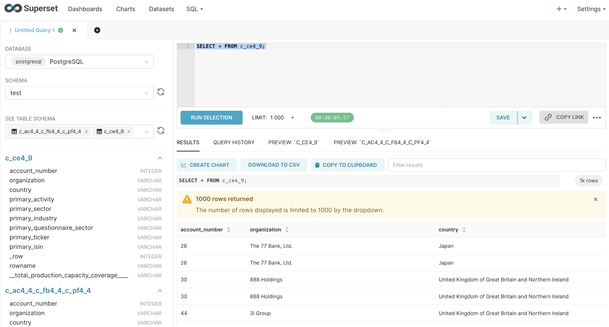

# NOT Doing Excel

## Overview


## Tech Stack


## Install the playground

1. Start `superset` on port `8088` with `postgresql` database on port `5432` and `jupyter` on port `8888`:
```bash
docker-compose up
```

> [!NOTE]
>
> If you encounter `unable to start container process: exec: "/app/docker/docker-init.sh": permission denied: unknown`, you can do the following:
> 
> `chmod -R u=rwx,g=rwx,o=rwx docker`

> [!NOTE]
>
> If you encounter `error getting credentials - err: docker-credential-desktop resolves to executable in current directory (./docker-credential-desktop)`, you can remove the following line from the from the file `~/.docker/config.json`:
>
> `"credsStore": "desktop",`

Now, let's go to http://localhost:8088/ in our browser, and login with the safest duo ever (`admin` as user, and `admin` as password).

2. Connect to the database `superset` with the following configuration using `PostgreSQL`:
- HOST: `superset_db`
- PORT: 5432
- DATABASE NAME: `superset`
- USERNAME: `superset`
- PASSWORD: `superset`

## Insert the data

1. Create the `python` virtual environment:
```bash
python -m venv venv
source venv/bin/activate
pip install -r requirements.txt
```

> [!NOTE]
>
> For M1/2 chips, issues will occur during the installation of `psycopg2`, and the reference is [here](https://gist.github.com/bruno-uy/f6c7618e7c3d917ba18fa0f7e2d05426).
> 
> In order to install `psycopg2` for M1/2 chips, execute the following commands first before `pip install -r requirements.txt`:
> ```bash
> brew install postgresql
> brew install openssl
> ```

> [!NOTE]
>
> If the directory `data/raw` is empty before preparing data, please carry out the following steps:
> 1. Create the folder `data/raw` under this repo.
> 2. Copy some Excel files to the above folder.

2. Prepare the data from `xlsx` format to `csv` format, and the CSV files will be generated under the folder `data/prepared`:
```bash
python prepare.py
```

3. Push the prepared CSV files to the database:
```bash
python push.py
```

## Query the data

Option 1: You can query the data in Superset via http://localhost:8088/sqllab/:



Option 2: You can query the data in Jupyter via a link that you can find by `docker logs jupyter_notebook`, which looks like http://127.0.0.1:8888/lab?token=xxx. The example code is [in this link](notebooks/test.ipynb).

## Follow-up questions

- Can it be automatic?
- Can you give examples of "raw" Excel files and PDFs, "cleaned" and "curated" data?
- What tool will you choose to clean the data if you have the freedom?

## References
- https://ourworldindata.org/co2-and-greenhouse-gas-emissions
- https://github.com/owid/co2-data
- https://python.langchain.com/docs/modules/data_connection/vectorstores/
- https://www.databricks.com/glossary/medallion-architecture
- https://developer.nvidia.com/blog/pandas-dataframe-tutorial-beginners-guide-to-gpu-accelerated-dataframes-in-python/
- https://github.com/gventuri/pandas-ai
- https://github.com/fugue-project/fugue
